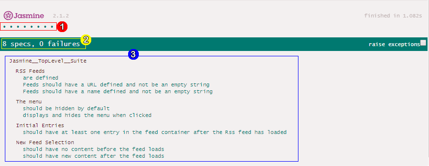

# (FEND) Feed Reader Testing Project
*by **Tony Boswell***

# Project Scenario Overview Given By Udacity

In this project I was given a web-based application that reads RSS feeds.

**The Scenario:** The original developer of this application clearly saw the value in testing, already including [Jasmine](http://jasmine.github.io/), and had even started writing their first test suite! Unfortunately, they decided to move on to start their own company and we're now left with an application with an incomplete test suite. That's where I come in.

## Steps Required to Successfully Run the Application

Simply open the index.html file in any browser, the feed reader will load and the Jasmine tests will commence.
***The testing portion will appear below the Feed itself, at the bottom of the page***, and its start will be indicated by the word "Jasmine".

*To the far right of the words* Jasmine, you should note that the all tests have completed by the words "***finished in x.xxxs***" which will be indicative of the time it took to run all the tests.

#### There are three places that provide information of the status of each tests:

 1. Each test will have either a red X or a green dot, just under the words Jasmine, which is also indicative of a pass or fail.  A red X signifies a failing test, while a green dot signifies a test passing.
 2. *Just below the words* Jasmine and the green dots and/or red x's there is a green heading that will state the number of tests, followed by the number of tests that failed.
 3. Finally, you will note the words -   **Jasmine__TopLevel__Suite**, under which you will find each section of the code that was tested, followed by the specifications(specs) for each test that was ran on the pre-existing code.

## Why this Project?

It's an important skill to have! Testing is an important part of the development process and many organizations practice a standard of development known as "test-driven development". This is when developers write tests first, before they ever start developing their application. All the tests initially fail and then they start writing application code to make these tests pass. *And this will be my task for this project!*

## What I have learned?

I have learned how Jasmine works and has its own distinct syntax and keywords, such as describes, it, and expects, just to name a few. Using this in combination with a few new methods, I learned how to perform conditional testing on a pre-existing application. This project also had us work through the testing of event handling and asynchronous operations.

# How I completed this project

Student were asked to review the Feed Reader Testing [Project Rubric](https://review.udacity.com/#!/projects/3442558598/rubric), after taking the JavaScript Testing [course](https://www.udacity.com/course/ud549). We were then given the  [required project assets](http://github.com/udacity/frontend-nanodegree-feedreader) to download and asked meet the following requirements:

1. Review the functionality of the application within your browser.
2. Explore the application's HTML (**./index.html**), CSS (**./css/style.css**) and JavaScript (**./js/app.js**) to gain an understanding of how it works.
3. Explore the Jasmine spec file in **./jasmine/spec/feedreader.js** and review the [Jasmine documentation](http://jasmine.github.io).
4. Edit the `allFeeds` variable in **./js/app.js** to make the provided test fail and see how Jasmine visualizes this failure in your application.
5. Return the `allFeeds` variable to a passing state.
6. Write a test that loops through each feed in the `allFeeds` object and ensures it has a URL defined and that the URL is not empty.
7. Write a test that loops through each feed in the `allFeeds` object and ensures it has a name defined and that the name is not empty.
8. Write a new test suite named `"The menu"`.
9. Write a test that ensures the menu element is hidden by default. You'll have to analyze the HTML and the CSS to determine how we're performing the hiding/showing of the menu element.
10. Write a test that ensures the menu changes visibility when the menu icon is clicked. This test should have two expectations: does the menu display when clicked and does it hide when clicked again.
11. Write a test suite named `"Initial Entries"`.
12. Write a test that ensures when the `loadFeed` function is called and completes its work, there is at least a single `.entry` element within the `.feed` container.
13. Write a test suite named `"New Feed Selection"`.
14. Write a test that ensures when a new feed is loaded by the `loadFeed` function that the content actually changes.
15. No test should be dependent on the results of another.
16. Callbacks should be used to ensure that feeds are loaded before they are tested.
17. Implement error handling for undefined variables and out-of-bound array access.
18. When complete - all of your tests should pass.
19. Write a README file detailing all steps required to successfully run the application.
